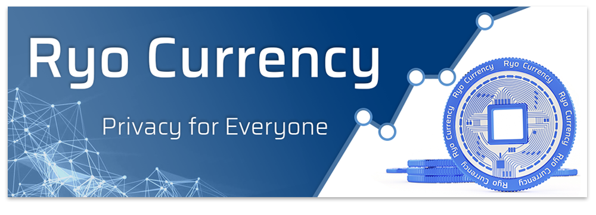
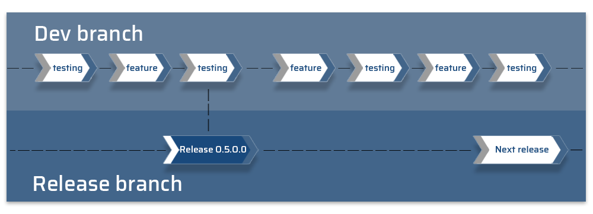
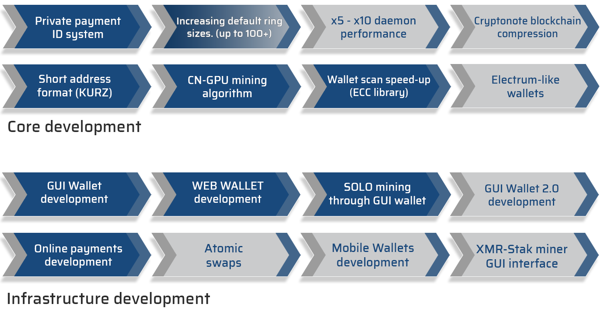
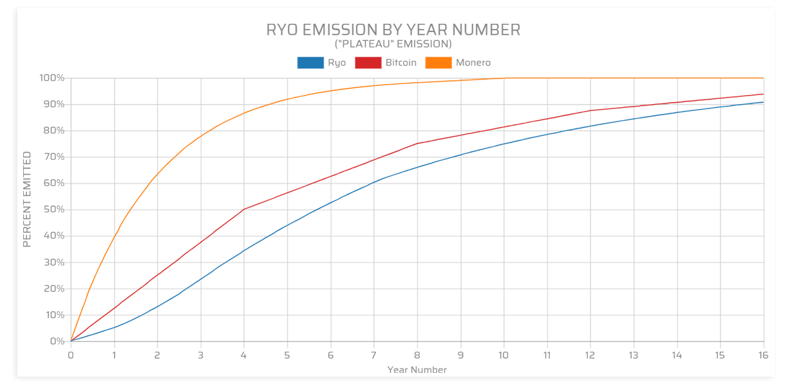
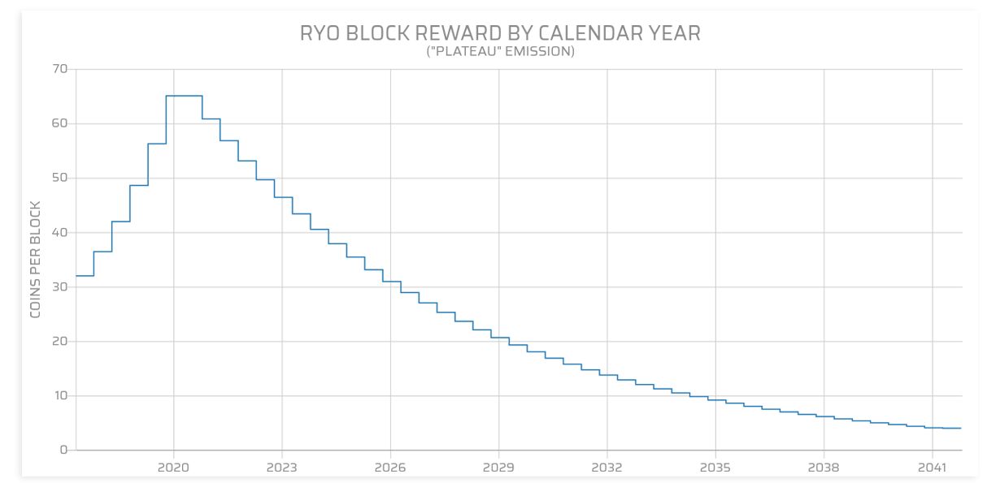

Ryo is one of very few cryptonote currencies that does actual, rapid development. Its team is led by fireice_uk, mosu_forge and psychocrypt who are the developers of [Cryptonight-GPU](https://medium.com/@crypto_ryo/cryptonight-gpu-fpga-proof-pow-algorithm-based-on-floating-point-instructions-92524debf8e8) and [Cryptonight-Heavy](https://github.com/ryo-currency/ryo-writeups/blob/master/cn-heavy.md) mining algorithms, GUI Wallet with built-in GPU solo mining feature called [Ryo Wallet Atom](https://ryo-currency.com/atom) and [Xmr-Stak](https://github.com/fireice-uk/xmr-stak/releases) miner.
- Website: [ryo-currency.com](https://ryo-currency.com)
- Mail: [contact@ryo-currency.com](mailto:contact@ryo-currency.com)

## Contents
|  |  |
| ---  | ---  |
| 1. [Introduction](#introduction) | 7. [Community](#community) |
| 2. [Check Development and get release binaries](#check-development-and-get-release-binaries) | 8. [Compiling Ryo from source](doc/compiling.md) |
| 3. [Project Roadmap](#project-roadmap) | 9. [Debugging](doc/debugging.md) |
| 4. [Features](#features) | 10. [LMDB](doc/lmdb.md) |
| 5. [Research and contributing](#research-and-contributing) | 11. [Using Ryo with TOR and Readline](doc/tor_readline.md) |
| 6. [Coin Supply & Emission](#coin-supply--emission) | 12. [Licensing details](#licensing-details) |

## Introduction
Ryo (両 in Japanese: one syllable) is the most **secure, private and untraceable cryptocurrency out there**. Ryo originated from the [_Tael_](https://en.wikipedia.org/wiki/Ry%C5%8D), an ancient Far East unit of weight standard used for exchanging gold and silver. Based on the foundations of Monero, Ryo emerged and is poised to dominate the privacy conscious crypto scene. Ryo is a fork of Sumokoin. You can read all fork-related information [here](doc/sumokoin.md).

## Check Development and get release binaries
  

Please note that code is developed on the [dev branch](https://github.com/ryo-currency/ryo-currency/tree/dev), if you want to check out the latest updates, before they are merged on main branch, please refer there. Master branch will always point to a version that we consider stable, so you can download the code by simply typing `git clone https://github.com/ryo-currency/ryo-currency.git`

Along with each release you can find our [precompiled binaries](https://github.com/ryo-currency/ryo-currency/releases).
To verify that the downloaded binaries are created by one of our developer please verify the checksums.
The authenticity of the checksums can be verified with the [PGP-key's](doc/pgp_keys.md).

## Project Roadmap
The Ryo dev team has several vectors of development, and it has already brought results that we can see.
  
Navigate to Ryo official website to explore development track record and [roadmap](https://ryo-currency.com#roadmap) details.

## Features
We have a solid track record and unique features that are not copied from other projects: 

### Core:
- **Built-in elliptic curve library**. This library significantly increases wallet scan speeds compared to other CN projects.
- **[Cryptonight-GPU mining algorithm](https://medium.com/@crypto_ryo/cryptonight-gpu-fpga-proof-pow-algorithm-based-on-floating-point-instructions-92524debf8e8)**. ASIC/FPGA/BOTNET resistant mining algorithm. GPU friendly and suitable for both AMD and Nvidia cards.
- **Uniform payment ID-s**. Our uniform payment ID system, makes transactions that use payment ID-s untraceable and hides the very fact that you use ID-s.
- **Default ring size of transactions set to 25**. Increased default ring size significantly reduces the chance of being identified, traced or attacked by blockchain statistical analysis.
- **QWMA mining difficulty algorithm**. Reworked network difficulty adjustment algorithm, to make it more adaptive to network hashrate fluctuations thus bringing more stabillity.
- **[Poisson probability check](https://github.com/ryo-currency/ryo-writeups/blob/master/poisson-writeup.md)**. This feature stops Verge-like offline timestamp attacks.
- **(Optional) Short address format**. Short address format for users who don't need viewkey.
- **CRC-12 mnemonic seed validation** / **Non-latin characters support** / **Varios critical bugfixes**

### Infrastructure
- **[Ryo Wallet Atom](https://ryo-currency.com/atom)**. Modern, intuitive and rich with feature GUI wallet. Available for Windows, Linux and MacOSX.
- **[Quasar Web wallet](https://ryowebwallet.com)**. Ultra-fast WEB based wallet that shares same design with Atom wallet.
- **[Solo mining in GUI wallet](https://solo-pool.ryoblocks.com/getting-started)**. Built-in pool software with workers support, statistics and charts display.
- **[Woo commerce plugin](https://github.com/ryo-currency/ryo-payments-woocommerce-gateway)**. Plug-in for web developers, to implement accepting Ryo on website.
- **[Ryo Business room](https://ryo-currency.com/ryo-business-room)**. Business community of people fostering ecosystem development.

GUI wallet | Web wallet | Cli wallet | Mobile | Hardware
--- | --- | --- | --- | ---
[v. 1.4.0](https://github.com/ryo-currency/ryo-wallet/releases/latest) | [Ryowebwallet](https://www.ryowebwallet.com/wallet-select) | [v. 0.4.1.0](https://github.com/ryo-currency/ryo-currency/releases/latest) | Developing | Planned

## Research and contributing
With privacy and security as the core foundation of Ryo, we invest time and effort into security research as well as investigate and analyze issues with the Cryptonote protocol in order to bring true default anonymity for users.
- [Hiding your IP while using Ryo or other Cryptonotes](https://www.reddit.com/r/ryocurrency/comments/a4mppi/hiding_your_ip_while_using_ryo_or_other/)
- [Tracing Cryptonote ring signatures using external metadata](https://medium.com/@crypto_ryo/tracing-cryptonote-ring-signatures-using-external-metadata-8e4866810006).
- [How buying pot with Monero will get you busted — Knacc attack on Cryptonote coins](https://medium.com/@crypto_ryo/how-buying-pot-with-monero-will-get-you-busted-knacc-attack-on-cryptonote-coins-b157cd97e82f).
- [On-chain tracking of Monero and other Cryptonotes](https://medium.com/@crypto_ryo/on-chain-tracking-of-monero-and-other-cryptonotes-e0afc6752527).  
You can find all write-ups in our [Ryo library](https://ryo-currency.com/library/) on the website.

Although Ryo Currency code in main repository is source available until February 2020, we have contributed back bug fixes and features to Monero project:
- [Add Unicode input line](https://github.com/monero-project/monero/pull/4390).
- [Fix for a wallet caching bug](https://github.com/monero-project/monero/pull/4247).  
Loki Project decided to use own version of wallet, based on Ryo Wallet Atom [(libre repository)](https://github.com/ryo-currency/ryo-wallet-libre) as official GUI wallet. Triton Project uses GUI wallet that is based on Ryo Wallet Atom too.
 

## Coin Supply & Emission
- **Total supply**: **88,188,888** coins in 20 years, then **263,000** coins will be emitted yearly to account for inflation.
- More than **80 million coins are available** for community mining.
- 8,790,000 Ryo coins were burned to get rid of the original Sumokoin premine. (You can check [burned premine keyimages](https://github.com/ryo-currency/ryo-currency/tree/master/utils/burned_premine_keyimages)). Additionally, 100,000 coins were premined and instantly unlocked to Sumokoin devs in 2017. The pre-mined coins have been [frozen/burned](https://github.com/ryo-currency/ryo-currency/blob/917dbb993178bb8a2ea571f214b15adcbb7c708f/src/blockchain_db/blockchain_db.cpp#L364) as announced on [reddit](https://www.reddit.com/r/ryocurrency/comments/8nb8eq/direction_for_ryo/). This can be verified using [those](/doc/verify_premine_burn_instructions.md) instructions.

- After 2 rounds of community debates [(pt1](https://www.reddit.com/r/ryocurrency/comments/8xsyqo/community_debate_lets_talk_about_the_development/e26i1vw/) / [pt2)](https://github.com/ryo-currency/ryo-writeups/blob/master/dev-fund.md) **8,000,000** Ryo coins were introduced as development fund which is located in 2/3 multisig wallet and emitted on weekly basis next 6 years. In an effort to provide transparency to the community on how the development fund is allocated, Ryo dev team built the following [dev-fund explorer page](https://ryo-currency.com/dev-fund/).

- **Coin symbol**: **RYO**
- **Hash algorithm**: CryptoNight-GPU (ASIC/FPGA/Botnet resistant Proof-Of-Work)
- **Total supply**: **88,188,888** coins in 20 years (including 8M dev. fund). Then 263,000 coins each year for inflation.
- **Block time**: **240 seconds** (difficulty is adjusted every block)
- **Coin Units**:
  + 1 nanoRyo &nbsp;= 0.000000001 **RYO** (10-9-_the smallest coin unit_)
  + 1 microRyo = 0.000001 **RYO** (10-6)
  + 1 milliRyo = 0.001 **RYO** (10-3)
- **Emission scheme**: Ryo's block reward changes _every 6-months_ according to the following "Plateau" distribution*. Our emission scheme is inspired by real-world mining production comparable to crude oil, coal and gas which is often slow at first, accelerated in the next few years before declining and becoming depleted. However, the emission path of Ryo is generally not that far apart from Bitcoin. The emission curve for Ryo was one of the final aspects of the code we inherited from Sumokoin that was re-written and had to be even [fixed](https://medium.com/@ryo.currency/fixing-a-broken-emission-curve-818300e145a2) during May 2019 [community debates](https://github.com/ryo-currency/ryo-writeups/blob/master/emission-change-part-two.md).

 

## Community
You can join our [community](https://ryo-currency.com/social) and ask the developers about their perspectives, ask for technical support, and get the latest news

## Licensing details
This is the core implementation of Ryo. It is free to get and modify for your own usage, however, you [can't](https://www.reddit.com/r/ryocurrency/comments/8tc5tg/decision_our_source_code_will_be_sourceavailable) distribute modified copies from this repository.

[Ryo-libre](https://github.com/ryo-currency/ryo-libre) is open source and completely free to use version of this repository without restrictions which is updated on yearly basis. There are no restrictions on anyone creating an alternative implementation of Ryo that uses the protocol and network in a compatible manner. [(Read more about Ryo-libre)](https://www.reddit.com/r/ryocurrency/comments/am4g0y/ann_ryolibre_open_source_repository_of_ryo)

Copyright (c) 2019, Ryo Currency Project

Copyright (c) 2014-2017, The Monero Project

Copyright (c) 2012-2013, The Cryptonote developers

Copyright (c) 2017, Sumokoin.org
